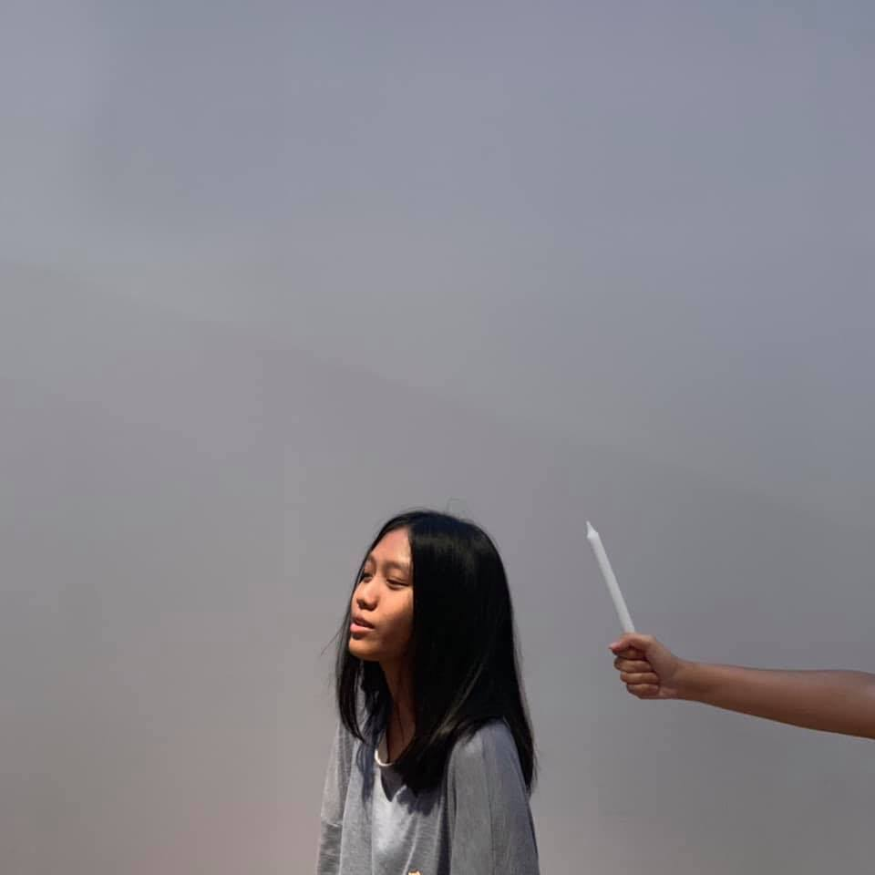

# STUDY PLANET คืออะไร? :full_moon_with_face:
**_STUDY PLANET_** เป็นเว็บไซต์สำหรับการเรียนรู้การเขียนโปรแกรมเชิงวัตถุด้วยภาษาจาวา โดยเนื้อหาภายในเว็บไซต์ของเราจะประกอบไปด้วยความรู้พื้นฐานของภาษาจาวา ไปจนถึงหลักการเขียนโปรแกรมเชิงวัตถุพื้นฐาน 

## Objectives :interrobang:
ในปัจจุบันเทคนิคการเขียนโปรแกรมเชิงวัตถุมีความสำคัญอย่างมากในการเขียนโปรแกรม เนื่องจากได้รับความนิยมอย่างแพร่หลาย และมีความสำคัญต่อการจัดระเบียบข้อมูลในปัจจุบัน เพราะเทคนิคนี้ทำให้รูปแบบการเขียนโปรแกรมง่ายต่อการพัฒนาและแก้ไขในภายหลัง 
  
นอกจากจะมีการป้องกันการเข้าถึงข้อมูลแล้วนั้น ในอีกแง่นึงยังสามารถนำไปใช้ได้อย่างไม่ยุ่งยากซับซ้อน และกลับไปใช้ซ้ำโดยไม่ต้องทำการเขียนโปรแกรมใหม่ 
 Link : study-planet.netlify.app
## Technology :wrench:
* HTML
* CSS
* Javascript
* Bootstrap
* Firebase
## Our Members! :family:
|||||
|:-------------:|:-------------:|:-------------:|:-------------:|
| 61070017      | 61070155      | 61070204      | 61070206      |
| Kittiwat      | Pattaranan    | Wasitpol      | Wareerat      |
| [@Kittiwat17]() | [@pythhh]() | [@RewiKaze]() | [@pamnana]()  
